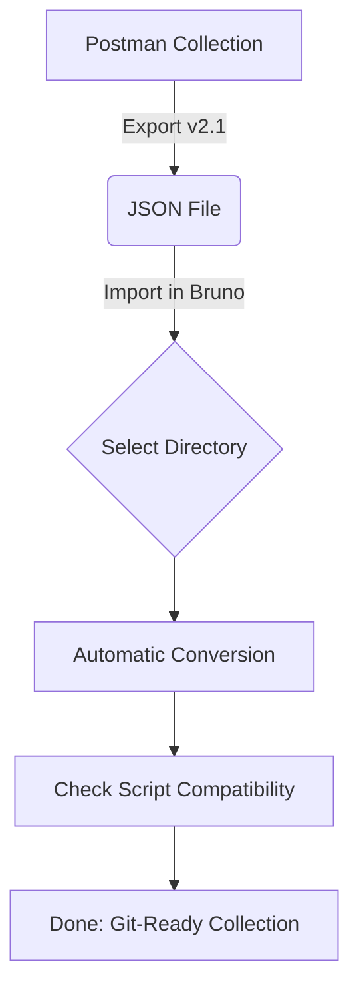
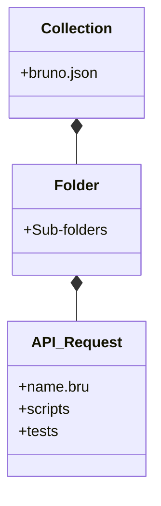

# 🚀 Bruno: 現代化開源 API 協作工具方案

> **打破雲端綁架，回歸 Git 驅動的 API 開發體驗。**

[](https://github.com/usebruno/bruno)
[](https://opensource.org/licenses/MIT)
[](https://www.usebruno.com/)

---

## 📖 1. 什麼是 Bruno？

[Bruno](https://www.usebruno.com/) 是一個開源且強大的新型 API 客戶端工具 (API Client)，被廣泛視為 **Postman** 與 **Insomnia** 的最佳現代開源替代方案。

### 核心哲學

與其強迫將資料儲存在雲端，Bruno 選擇將 API 請求儲存為 **純文字檔案**（如 `.bru` 或 `.yml`）。這讓 API 的演進能與原始碼同步，實現真正的 **API-as-Code**。

---

## 💎 2. 為什麼選擇 Bruno？ (核心優勢)

| 特性         | Bruno                     | 傳統工具 (如 Postman)    |
| :----------- | :------------------------ | :----------------------- |
| **數據存儲** | 本地純文字檔 (Git 友善)   | 強制雲端資料庫           |
| **隱私安全** | 100% 離線運算，無資安疑慮 | 有泄露至第三方伺服器風險 |
| **協作成本** | 完全免費，透過 PR 協作    | 按人頭收費，高昂成本     |
| **效能體驗** | 極度輕量、啟動即用        | 日漸臃腫、載入緩慢       |
| **自動化**   | 完美整合 CI/CD (CLI)      | 整合配置相對複雜         |

---

## 🛠️ 3. 安裝指南 (macOS)

> [!TIP]
> **建議使用 Homebrew 安裝**，方便日後透過指令一鍵更新所有開發工具。

### 方式 A：Homebrew 指令 (推薦)

```bash
brew install homebrew/cask/bruno
```

### 方式 B：官網下載

前往 [Bruno Downloads](https://www.usebruno.com/downloads) 下載對應您 Mac 晶片 (Apple Silicon M1/M2/M3 或 Intel) 的 `.dmg` 檔案。

---

## 🔄 4. 從 Postman 無痛轉移

> 📦 **預覽須知**：以下流程圖使用 Mermaid 語法繪製。若在 VS Code 中看不到圖示，請安裝擴充套件 [Markdown Preview Mermaid Support](https://marketplace.visualstudio.com/items?itemName=bierner.markdown-mermaid)（搜尋 `bierner.markdown-mermaid`）後重新開啟預覽。



### 4.1 轉移後的工程化目錄結構

匯入後，您的 API 專案會從單一 JSON 轉化為清晰的實體目錄：

```text
API-Project-Name/
├── bruno.json               # 集合宣告檔 (Root)
├── environments/            # 環境變數定義
│   └── Local.yml            # Local 環境設定
├── Auth/                    # API 分群資料夾
│   ├── Login.bru            # 獨立的 API 請求檔
│   └── Logout.bru
└── Users/
    └── Profile.bru
```



### 4.2 腳本語法對照表 (Troubleshooting)

如果您原本在 Postman 有撰寫測試腳本，請依下表進行微調：

| 功能項目           | Postman 語法 (舊)              | Bruno 語法 (新)              |
| :----------------- | :----------------------------- | :--------------------------- |
| **取得環境變數**   | `pm.environment.get("id")`     | `bru.getEnvVar("id")`        |
| **設定環境變數**   | `pm.environment.set("id", 1)`  | `bru.setEnvVar("id", 1)`     |
| **解析 JSON 回應** | `pm.response.json()`           | `res.getBody()`              |
| **取得 Header**    | `pm.response.headers.get("X")` | `res.getHeader("X")`         |
| **輔助請求**       | `pm.sendRequest(...)`          | `await bru.sendRequest(...)` |

---

## 🤖 5. 自動化測試與 CLI

### CLI 安裝

```bash
npm install -g @usebruno/cli
```

### 常用測試指令

> [!IMPORTANT]
> 執行 `bru run` 時，路徑必須位於包含 `bruno.json` 的 **根目錄**。

- **執行單一測試**：
  ```bash
  bru run Auth/Login.bru --env Local
  ```
- **執行全項目並產出 JUnit 報告 (CI/CD 友善)**：
  ```bash
  bru run --env Local --output results.xml --format junit
  ```
- **開啟除錯模式**：
  ```bash
  bru run Auth/Login.bru --env Local --verbose
  ```

---

## Postman CLI 執行整個 Collection

```bash!
npx newman run "postman/Collection.postman_collection.json"
```

## Postman CLI 執行整個目錄

```bash!
cd /Users/user/github/bruno-test

# npx 會自動下載並執行 newman
npx newman run "postman/Collection.postman_collection.json" --folder "login"
```

## Bruno CLI 執行整個 Collection

```bash!
(cd "Collection" && bru run --env Local --output results.json)
```

## Bruno CLI 執行整個目錄

```bash!
cd /Users/user/github/bruno-test/Collection
bru run "my-api/login" --env Local
```

---

## 💡 總結

Bruno 不僅是一個工具，更是一種對 **開發者主權** 的回歸。它讓 API 測試資料不再是孤島，而是與專案代碼並肩作戰的資產。對於重視資安、效能與版控準確性的 Laravel 或現代化 Web 專案，Bruno 是絕對的首選。

<!-- [😸SAM] -->
